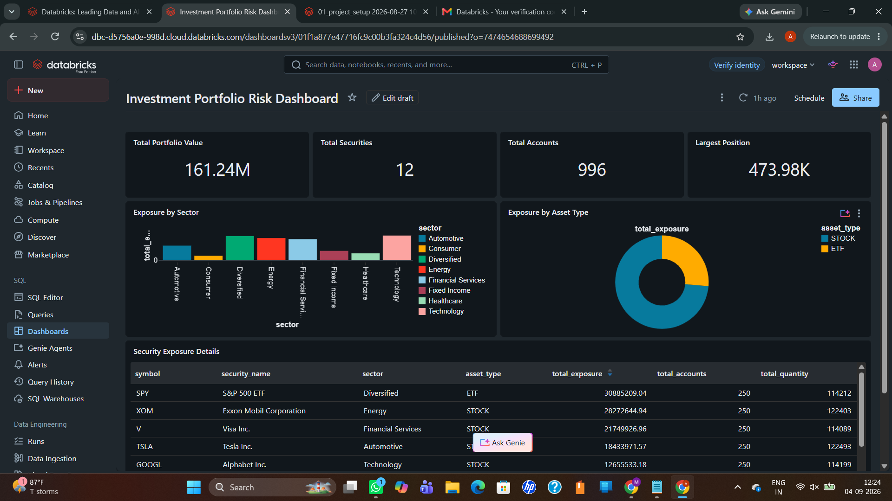

# Investment Portfolio Risk Analytics Platform

An end-to-end Databricks SQL project that turns synthetic account, trade, security, and market-price data into validated portfolio and risk reports.

~~~mermaid
flowchart LR
    A["Synthetic source data"] --> B["Bronze: raw Delta tables"]
    B --> C["Silver: validated data"]
    C --> D["Gold: portfolio metrics"]
    D --> E["Databricks dashboard"]
~~~

## Dashboard

The dashboard presents total portfolio value, active portfolio accounts, number of securities, largest position, exposure by sector and asset type, and security-level exposure details.

## Business problem

A financial firm needs clean, reliable data for monitoring trading activity, current portfolio values, and concentration risk. Raw records are not ready for reporting because they can contain missing customer details, invalid references, duplicates, or incorrect numeric values.

This pipeline validates the data, separates rejected records, calculates current positions using the latest market prices, and creates business-ready Gold tables for a risk dashboard.

## Technology

- Databricks SQL
- Delta Lake
- Unity Catalog
- SQL window functions and common table expressions
- Databricks AI/BI Dashboards

## Data model

| Layer | Tables | Purpose |
| --- | --- | --- |
| Bronze | accounts_raw, securities_raw, trades_raw, market_prices_raw | Preserve generated source data |
| Silver | accounts_clean, accounts_rejected, securities_clean, trades_clean, trades_rejected, market_prices_clean | Validate data and retain rejected records |
| Gold | daily_trade_summary, latest_market_prices, portfolio_positions, account_portfolio_summary | Calculate trading and account metrics |
| Gold | security_exposure_summary, security_exposure_report, sector_exposure_summary | Create security and concentration-risk reports |

## Main transformations

1. Generate 1,000 accounts, 12 securities, 50,000 trades, and 8,640 hourly price records.
2. Remove or reject accounts with missing customer names.
3. Keep trades only when their account and security references are valid.
4. Validate positive prices and quantities and non-negative trading volume.
5. Use ROW_NUMBER to select the latest price for every security.
6. Calculate net quantity as purchases minus sales.
7. Calculate current market value as net quantity multiplied by latest price.
8. Aggregate results by account, security, sector, and asset type.

## Repository structure

~~~text
investment-portfolio-risk-analytics/
├── README.md
├── investment_portfolio_pipeline.ipynb
├── 01_setup_and_bronze.sql
├── 02_silver_transformations.sql
├── 03_gold_analytics.sql
├── 04_dashboard_queries.sql
├── dashboard.png
└── interview-guide.md
~~~

## How to run

1. Import investment_portfolio_pipeline.ipynb into Databricks.
2. Attach serverless or SQL compute with permission to create catalogs and Delta tables.
3. Run the notebook cells in order.
4. Run 04_dashboard_queries.sql to create the dashboard datasets.
5. Build or refresh the Databricks dashboard from those datasets.

The code uses CREATE OR REPLACE TABLE, so rerunning it replaces the project tables.

For interview practice, see [interview-guide.md](interview-guide.md).

## Data-quality checks

- Required customer and security fields cannot be null.
- Account types and statuses must match expected values.
- Trade type must be BUY or SELL.
- Trade quantity and trade price must be positive.
- Market price must be positive and trading volume cannot be negative.
- Trade account and security IDs must exist in the clean reference tables.
- Rejected accounts and trades are retained with a rejection reason.

## Important dashboard validation

The account KPI comes from account_portfolio_summary. Account counts from different sectors must not be added because one account can invest in several sectors and would be counted repeatedly.

## Interview summary

> I built an investment portfolio and risk analytics pipeline in Databricks using Bronze, Silver, and Gold layers. I generated account, security, trade, and market-price data and stored it in Delta tables. In the Silver layer, I validated required fields, removed duplicates, verified account and security references, and retained rejected records with reasons. In the Gold layer, I selected the latest price for each security using a window function, calculated net positions and current market value, and created account, security, sector, and asset-type summaries. I then built and validated a dashboard for portfolio value and concentration risk.

## Future enhancements

- Ingest live trades with Kafka and Spark Structured Streaming
- Process only new and updated records instead of rebuilding full tables
- Add orchestration, alerts, and automated data-quality tests
- Add weighted-average cost and realized/unrealized profit calculations

## Note

All data is synthetic and created for learning and portfolio demonstration. The repository does not contain customer or production financial data.
